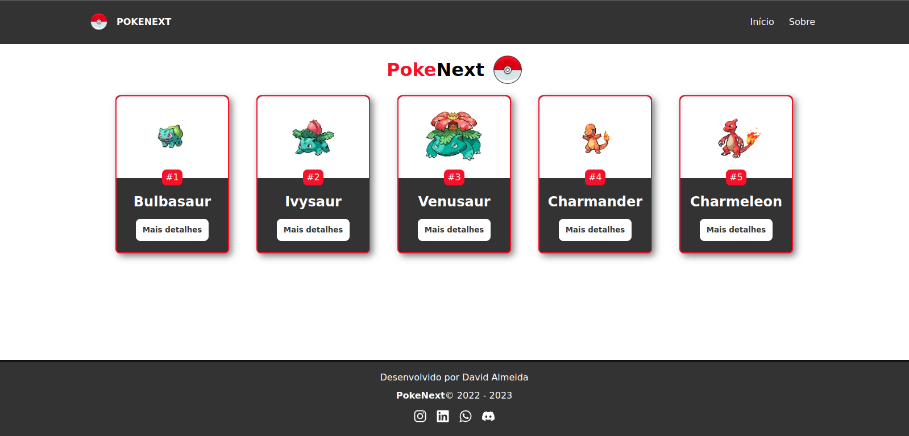
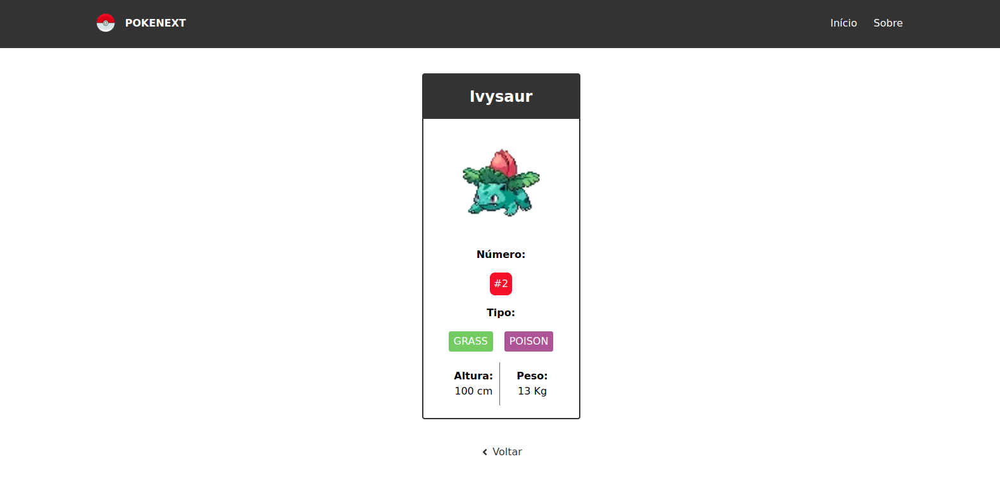
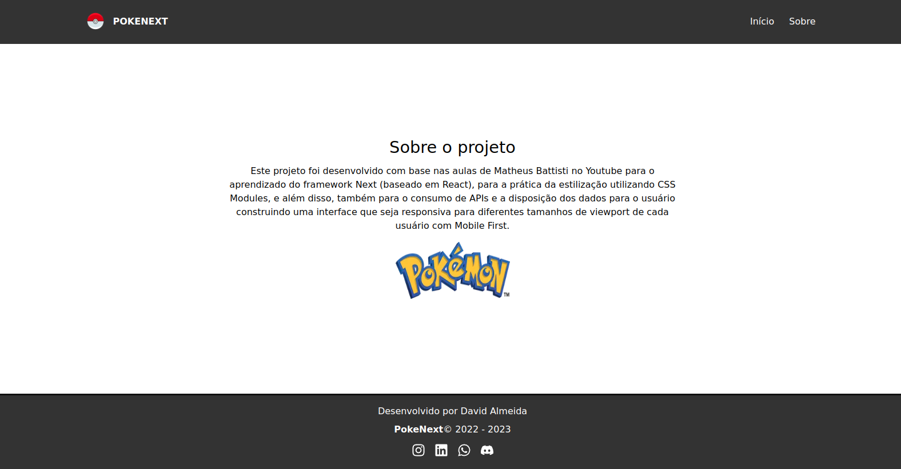

<div align="center">
  <h1>🔴 Project: PokeNext</h1>
</div>

<div align="center">
  
</div>

<div align="center">
  <p>
    This project is an introduction to Next to learn some features, configurations and how to style each part of the code using CSS Modules, in addition, we use API consumption to display data about various pokemons and also display detailed information on pages created for each specific character through the native routing that Next provides us.
  </p>
</div>

<div align="center">
  <a href="https://classic.yarnpkg.com/lang/en/docs/" target="_blank">
    
  </a>
  <a href="https://www.npmjs.com/package/next" target="_blank">
    
  </a>
  <a href="https://www.npmjs.com/package/react" target="_blank">
    
  </a>
  <a href="https://www.npmjs.com/package/react-icons" target="_blank">
    
  </a>
  <a href="https://choosealicense.com/" target="_blank">
    
  </a>
  <a href="https://vercel.com/" target="_blank">
    
  </a>
</div>

## 🛠️ Technologies

- HTML5, CSS3, JS ES6+
- [Node e Yarn](https://nodejs.org/)
- [Next.js](https://nextjs.org/docs)
- [React](https://react.dev/)
- [React-icons](https://react-icons.github.io/react-icons/)
- [Eslint](https://eslint.org/)
- [Prettier](https://prettier.io/)

## 📣 Funcionalities

- Display of all characters on screen
- Fetch data from the API
- Custom error pages
- Individual display of characters by routing

## 💿 Installing

Install the project with the following command

```bash
  yarn install
```

## 💻 Running project

```bash
  yarn dev
```

## 🚀 Deploy

To deploy this project, execute

```bash
  vercel
```

## 🧰 Used stacks

**Front-end:** HTML5, CSS3, Javascript, CSS Modules, React, React-icons

**Back-end:** Not used

## 📸 Screenshots







## 📝 License

This project is under [MIT license](LICENSE).